# ♻️ Solar-Powered Compost Heater Prototype

A microcontroller-based compost heater control system designed to maintain optimal temperature conditions for accelerated composting processes. This prototype utilizes temperature feedback control to automatically regulate heating elements, ensuring efficient decomposition while minimizing energy consumption.

## 🎯 Project Overview

This project implements an automated temperature control system for compost heaters using:
- **DHT22 sensor** for real-time temperature and humidity monitoring
- **Relay module** for switching a **nichrome wire heating element**
- **Arduino Uno R3** microcontroller for control logic
- **12V battery system** with buck converter for sustainable power supply

The system maintains compost temperature within the optimal thermophilic range (55-70°C) to accelerate decomposition and eliminate pathogenic organisms.

---

## 📐 System Architecture

```mermaid
graph TD
    A[12V Solar Battery System] --> B[Buck Converter (12V to 5V)]
    B --> C[Arduino Uno R3]
    C --> DHT22[DHT22 Temperature/Humidity Sensor]
    C --> Relay[Relay Module]
    Relay --> Heater[Nichrome Wire Heating Element]
    C --> Status[Status Monitoring]
    
    subgraph "Control Loop"
        Sense[Temperature Sensing] --> Compare[Temperature Comparison]
        Compare --> Decision{T < 55°C?}
        Decision -->|Yes| HeatOn[Activate Heater]
        Decision -->|No| HeatOff[Deactivate Heater]
        HeatOn --> Sense
        HeatOff --> Sense
    end
```

---

## ⚡ Electrical Wiring Diagram


---

## 🧠 Control Algorithm

```mermaid
flowchart TD
    START([System Initialization])
    INIT["Initialize Serial Communication
    Configure DHT22 Sensor
    Set Relay Pin as Output
    Initial State: Heater OFF"]
    
    LOOP_START[Main Control Loop]
    READ_SENSOR["Read Temperature & Humidity
    from DHT22 Sensor"]
    
    VALIDATE{"Sensor Reading
    Valid?"}
    ERROR["Log Error Message
    Return to Loop"]
    
    LOG["Serial Output:
    Temperature & Humidity Data"]
    
    TEMP_CHECK{"Temperature
    < 55°C?"}
    TEMP_HIGH{"Temperature
    > 70°C?"}
    
    HEATER_ON["Activate Relay
    digitalWrite RELAY_PIN HIGH
    Nichrome Heater: ON"]
    
    HEATER_OFF["Deactivate Relay
    digitalWrite RELAY_PIN LOW
    Nichrome Heater: OFF"]
    
    MAINTAIN["Maintain Current State
    55°C ≤ T ≤ 70°C"]
    
    DELAY["Wait 3 seconds
    delay 3000"]
    
    START --> INIT --> LOOP_START --> READ_SENSOR --> VALIDATE
    VALIDATE -->|No| ERROR --> DELAY --> LOOP_START
    VALIDATE -->|Yes| LOG --> TEMP_CHECK
    
    TEMP_CHECK -->|Yes| HEATER_ON --> DELAY --> LOOP_START
    TEMP_CHECK -->|No| TEMP_HIGH
    TEMP_HIGH -->|Yes| HEATER_OFF --> DELAY --> LOOP_START
    TEMP_HIGH -->|No| MAINTAIN --> DELAY --> LOOP_START
```



---

## 🛠️ Bill of Materials (BOM)

| Component | Specification | Quantity | Purpose | Notes |
|-----------|---------------|----------|---------|-------|
| Arduino Uno R3 | ATmega328P, 5V/16MHz | 1 | Main microcontroller | Primary control unit |
| DHT22 Sensor | AM2302, ±0.5°C accuracy | 1 | Temperature/humidity sensing | 3.3-5V compatible |
| Relay Module | 5V coil, 10A/250VAC contacts | 1 | Heater switching | Optocoupler isolated |
| Nichrome Wire | 20 AWG, 10-15W resistance | 1m | Heating element | ~3.3Ω/ft at 20°C |
| Buck Converter | LM2596, 12V→5V/3A | 1 | Voltage regulation | Adjustable output |
| 12V Battery | SLA/Li-ion, 7-12Ah capacity | 1 | Primary power source | Solar charging compatible |
| Flyback Diode | 1N4007, 1A/1000V | 1 | Relay protection | Prevents voltage spikes |
| Pull-up Resistor | 10kΩ, 1/4W | 1 | DHT22 data line | Ensures signal integrity |
| Jumper Wires | 22 AWG, various lengths | 1 set | Interconnections | Dupont connectors preferred |
| Breadboard/PCB | Half-size or custom | 1 | Circuit assembly | Prototype or permanent |
| Enclosure | IP65 rated, ABS plastic | 1 | Weather protection | Field deployment |

---

## 🔌 Pin Configuration & Connections

| Arduino Pin | Function | Connected Component | Electrical Specs |
|-------------|----------|-------------------|------------------|
| Digital Pin 2 | DHT22 Data | DHT22 Signal Pin | 5V logic, 10kΩ pull-up |
| Digital Pin 7 | Relay Control | Relay Module IN | 5V output, 20mA max |
| 5V Rail | Power Supply | DHT22 VCC, Relay VCC | Buck converter output |
| GND Rail | Ground Reference | All component grounds | Common ground plane |
| VIN | External Power | Buck converter input | 7-12V DC input |

### Wiring Schematic Details

```
DHT22 Connections:
- Pin 1 (VCC) → Arduino 5V
- Pin 2 (Data) → Arduino D2 + 10kΩ pull-up to 5V
- Pin 3 (NC) → Not connected
- Pin 4 (GND) → Arduino GND

Relay Module Connections:
- VCC → Arduino 5V
- GND → Arduino GND  
- IN → Arduino D7
- NO (Normally Open) → Nichrome wire positive
- COM (Common) → 12V battery positive
- NC (Normally Closed) → Not used

Power Distribution:
- 12V Battery (+) → Buck converter VIN, Relay COM
- 12V Battery (-) → Ground rail
- Buck converter VOUT → Arduino VIN/5V rail
- Buck converter GND → Ground rail
```

---

## 📜 Firmware Implementation

The control firmware implements a hysteresis-based temperature control algorithm to prevent rapid switching and extend relay lifetime.

### Key Features:
- **Temperature Monitoring**: Continuous DHT22 sensor readings every 3 seconds
- **Hysteresis Control**: 
  - Heater ON when T < 55°C (lower threshold)
  - Heater OFF when T > 70°C (upper threshold)
  - 15°C hysteresis band prevents oscillation
- **Error Handling**: NaN detection and graceful error recovery
- **Serial Monitoring**: Real-time data logging for debugging and analysis

### Control Parameters:
- **Sampling Rate**: 0.33 Hz (3-second intervals)
- **Temperature Range**: 55°C - 70°C (thermophilic composting range)
- **Sensor Accuracy**: ±0.5°C (DHT22 specification)
- **Response Time**: < 3 seconds for temperature changes

---

## 🧪 Testing & Validation Protocol

### 1. System Integration Test
```bash
# Upload firmware to Arduino
# Connect all components per wiring diagram
# Apply 12V power and verify 5V regulation
# Confirm DHT22 sensor readings via Serial Monitor
```

### 2. Temperature Control Validation
- **Test Condition 1**: Ambient temperature < 55°C
  - **Expected**: Relay activates, heater ON
  - **Verification**: Multimeter continuity test across relay contacts
  
- **Test Condition 2**: Heated temperature > 70°C  
  - **Expected**: Relay deactivates, heater OFF
  - **Verification**: No continuity across relay contacts

### 3. Hysteresis Behavior Test
- **Objective**: Verify 15°C deadband prevents oscillation
- **Method**: Gradually heat/cool system through control thresholds
- **Success Criteria**: No rapid switching within hysteresis band

### 4. Long-term Stability Test
- **Duration**: 24-hour continuous operation
- **Monitoring**: Temperature logs, relay cycle count
- **Metrics**: Temperature stability ±2°C, <100 relay cycles/hour

---

## ⚠️ Safety Considerations & Risk Assessment

### Electrical Safety
- **Nichrome Wire Temperature**: Can exceed 200°C - risk of burns and fire
- **Mitigation**: Mount on ceramic/metal substrate, provide thermal insulation
- **Relay Contact Rating**: Ensure 20% safety margin above nichrome current draw
- **Ground Fault Protection**: GFCI recommended for outdoor installations

### Thermal Management
- **Heat Dissipation**: Provide adequate ventilation around heating elements
- **Temperature Monitoring**: Implement over-temperature shutdown if T > 80°C
- **Fire Prevention**: Use fire-resistant enclosure materials, maintain clearances

### Environmental Protection
- **Moisture Ingress**: IP65-rated enclosure for outdoor deployment
- **Corrosion Protection**: Stainless steel hardware, conformal coating on PCB
- **UV Stability**: UV-resistant plastics for long-term solar exposure

---

## 📈 Performance Optimization & Future Enhancements

### Phase 1 Improvements
- **PID Control Algorithm**: Replace bang-bang control with PID for improved stability
- **Wireless Connectivity**: ESP32 upgrade for remote monitoring and data logging
- **Battery Management**: Solar charge controller integration with battery state monitoring
- **Multi-Zone Control**: Expand to multiple heating zones with individual sensors

### Phase 2 Research Directions
- **pH Monitoring**: Integrate pH sensors for comprehensive compost analysis
- **Moisture Control**: Add ultrasonic humidification or drainage control
- **Aeration System**: Automatic turning/mixing based on temperature gradients
- **Machine Learning**: Predictive control based on weather and compost composition

### Performance Metrics
- **Energy Efficiency**: Target <50W average power consumption
- **Temperature Stability**: Maintain ±2°C within setpoint range
- **Battery Life**: 48+ hours autonomous operation without solar input
- **Reliability**: >99% uptime over 6-month deployment period

---

## 📊 Data Analysis & Monitoring

### Sensor Data Logging
```cpp
// Example data format for analysis
struct SensorReading {
    unsigned long timestamp;
    float temperature;
    float humidity;
    bool heaterState;
    float batteryVoltage;
};
```

### Key Performance Indicators
- **Temperature Control Accuracy**: Standard deviation from setpoint
- **Energy Consumption**: kWh per day, seasonal variations
- **Heater Duty Cycle**: Percentage of time heater is active
- **System Efficiency**: Compost temperature rise per unit energy input

---

## 🔗 Technical References & Standards

### Industry Standards
- **IEC 61000-6-3**: EMC Generic Standard for Residential Environments
- **IP65**: Ingress Protection Standard for Outdoor Electronics
- **UL 991**: Environmental Chambers Standard for Temperature Control

### Academic References
1. Haug, R.T. (1993). *The Practical Handbook of Compost Engineering*. Lewis Publishers.
2. Rynk, R. et al. (1992). *On-Farm Composting Handbook*. Northeast Regional Agricultural Engineering Service.
3. Tchobanoglous, G. et al. (2003). *Integrated Solid Waste Management*. McGraw-Hill.

### Component Datasheets
- [DHT22 Temperature/Humidity Sensor](https://www.sparkfun.com/datasheets/Sensors/Temperature/DHT22.pdf)
- [LM2596 Buck Converter](https://www.ti.com/lit/ds/symlink/lm2596.pdf)
- [ATmega328P Microcontroller](https://ww1.microchip.com/downloads/en/DeviceDoc/Atmel-7810-Automotive-Microcontrollers-ATmega328P_Datasheet.pdf)

---

## 📋 Project Status & Development Timeline

### Completed Milestones ✅
- [x] Hardware design and component selection
- [x] Basic firmware implementation with temperature control
- [x] Breadboard prototype testing
- [x] Initial validation of heating element performance

### Current Development 🔄
- [ ] PCB design and fabrication
- [ ] Enclosure design for outdoor deployment
- [ ] Solar charging system integration
- [ ] Long-term field testing

### Future Roadmap 🎯
- [ ] Wireless connectivity and remote monitoring
- [ ] Advanced control algorithms (PID)
- [ ] Multi-parameter sensing (pH, moisture)
- [ ] Commercial prototype development

---

## 🤝 Contributing & Collaboration

This project welcomes contributions from researchers, engineers, and makers interested in sustainable waste management and agricultural technology.

### How to Contribute
1. **Fork** the repository
2. **Create** a feature branch (`git checkout -b feature/enhancement`)
3. **Commit** your changes (`git commit -am 'Add new feature'`)
4. **Push** to the branch (`git push origin feature/enhancement`)
5. **Submit** a Pull Request

### Areas for Contribution
- Algorithm optimization and control theory improvements
- Sensor integration and calibration procedures
- Enclosure design and mechanical engineering
- Solar power system optimization
- Data analysis and visualization tools

---

## 📄 License & Intellectual Property

**MIT License**

Copyright (c) 2025 Solar Composter Heater Project

Permission is hereby granted, free of charge, to any person obtaining a copy
of this software and associated documentation files (the "Software"), to deal
in the Software without restriction, including without limitation the rights
to use, copy, modify, merge, publish, distribute, sublicense, and/or sell
copies of the Software, and to permit persons to whom the Software is
furnished to do so, subject to the following conditions:

The above copyright notice and this permission notice shall be included in all
copies or substantial portions of the Software.

THE SOFTWARE IS PROVIDED "AS IS", WITHOUT WARRANTY OF ANY KIND, EXPRESS OR
IMPLIED, INCLUDING BUT NOT LIMITED TO THE WARRANTIES OF MERCHANTABILITY,
FITNESS FOR A PARTICULAR PURPOSE AND NONINFRINGEMENT. IN NO EVENT SHALL THE
AUTHORS OR COPYRIGHT HOLDERS BE LIABLE FOR ANY CLAIM, DAMAGES OR OTHER
LIABILITY, WHETHER IN AN ACTION OF CONTRACT, TORT OR OTHERWISE, ARISING FROM,
OUT OF OR IN CONNECTION WITH THE SOFTWARE OR THE USE OR OTHER DEALINGS IN THE
SOFTWARE.

---

## 📞 Contact & Support

For technical questions, collaboration opportunities, or project support:

- **Project Repository**: [GitHub - Solar Composter Heater](https://github.com/username/solar-composter-heater)
- **Documentation**: [Project Wiki](https://github.com/username/solar-composter-heater/wiki)
- **Issues & Bugs**: [Issue Tracker](https://github.com/username/solar-composter-heater/issues)

---

*This project is developed as part of sustainable agriculture research initiatives, promoting closed-loop waste management systems and renewable energy applications in precision agriculture.*
